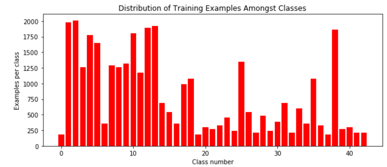
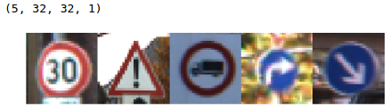
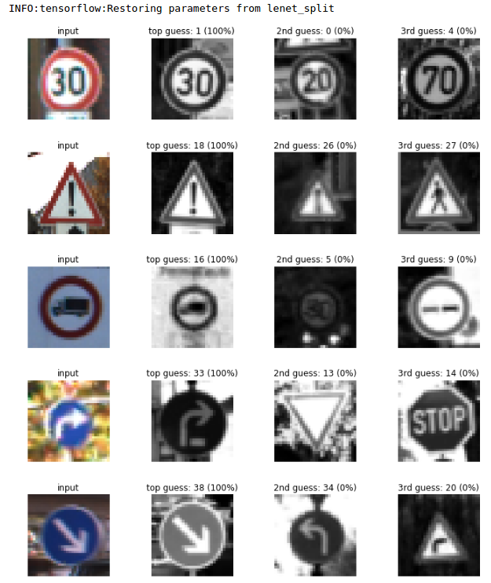

#**Traffic Sign Recognition** 

##Writeup

---

**Build a Traffic Sign Recognition Project**

The meaning of every blocks of this project are the following:
* 1.Load the data set (`/traffic-signs-data/train.p`, `/traffic-signs-data/valid.p`, `traffic-signs-data/test.p`).
* 2.visualize image and its label from `X_train`.
* 3.Explore, summarize and visualize the data set(`X_train`) using histogram.
* 4.Convert RGB image to grayscale.(`X_train`,`X_valid`,`X_test`)
* 5.Normalize datasets to (-1,1).(`X_train`,`X_valid`,`X_test`)
* 6.Define 4 function to create more dataset using  `random_translate(img)`, `random_warp(img)`, `random_scaling(img)`, `random_brightness(img)`.(`X_train`,`X_valid`)
* 7.Create more training dataset
* 8.Visualize the data set(`X_valid`) using histogram
* 9.Shuffle the training dataset
* 10.Define `EPOCHS` and `BATCH_SIZE`
* 11.Splitting 'training dataset' to 'traning and validation dataset', get `X_train_split`, `X_validation_split`, `y_train_split`, `y_validation_split`.
* 12.Architecture of `LeNet()`
* 13.Architecture of `LeNet2()`
* 14.Define some variables
* 15.Calculate some parameter `logits`, `cross_entropy`, `loss_operation`, `optimizer`, `training_operation`
* 16.Define `evaluate()` function
* 17.Training `X_train_normalized` and evaluating `X_valid_normalized`, `EPOCHS = 10`, and save the model `lenet.meta`.
* 18.Training `X_train_normalized` and evaluating `X_valid_normalized`, `EPOCHS = 60`, and save the model `lenet2.meta`.
* 19.Training `X_train_split` and evaluating `X_validation_split`, `EPOCHS = 10`, and save the model `lenet_split.meta`.
* 20.Test `X_test_normalized`
* 21.Read a new test image, and cheak image's size
* 22.Resize image to `32 by 32` and load five images and plot them
* 23.Predict these five images
* 24.Visualize the softmax probabilities.

## Rubric Points
###Here I will consider the [rubric points](https://review.udacity.com/#!/rubrics/481/view) individually and describe how I addressed each point in my implementation.  

---
###Writeup 

####1. Provide a Writeup / README that includes all the rubric points and how you addressed each one. 

You're reading it! and other attachment is in the same folder with this Writeup.

###Data Set Summary & Exploration

####1. I downloaded three dataset, `X_train`,`X_valid`,`X_test` from udacity website, but the original source is from German Traffic Sign Dataset.

I used the pandas library to calculate summary statistics of the traffic
signs data set:

* The size of training set is `X_train: (34799, 32, 32, 3)`, `y_train: (34799, )`
* The size of the validation set is ? `X_valid: (4410, 32, 32, 3)`, `y_valid: (4410, )`
* The size of test set is ?`X_test: (12630, 32, 32, 3)`, `y_test: (12630, )`
* The shape of a traffic sign image is ? `32*32*3`
* The number of unique classes/labels in the data set is ?  `43`

####2. Include an exploratory visualization of the dataset.

Here is an exploratory visualization of the training data set. It is a bar chart showing how many class of labels, and the number of examples per class.

###Design and Test a Model Architecture
####1.Preprocessing
First I change RGB image to Graysclar image, output `(32,32,1)`. And then I normalize the `X_train`,`X_valid`,`X_test` datasets to (-1,1). Lastly, I define 4 kinds of methods to create more dataset (`X_train`,`X_valid`).

####1. Describe what your final model architecture looks like including model type, layers, layer sizes, connectivity, etc.) Consider including a diagram and/or table describing the final model.

I show 2 different model in my code,`LeNet()` and `LeNet2()`, and both two I get the validation accuracy in code. It shows that validation accuracy result of `LeNet2()` is better than `LeNet()` , below I will just show my final model, my final model consisted of the following layers:

| Layer         		|     Description	        					| 
|:---------------------:|:---------------------------------------------:| 
| Input         		| 32x32x3 RGB image   							| 
| Convolution 5x5     	| 1x1 stride, valid padding, outputs 28x28x6 	|
| RELU					|												|
| Max pooling	      	| 2x2 stride, outputs 14x14x6 					|
| Convolution 5x5	    | 1x1 stride, valid padding, outputs 10x10x16	|
| RELU					|												|
| Max pooling	      	| 2x2 stride,  outputs 5x5x16 					|
| Convolution 5x5	    | 1x1 stride, valid padding, outputs 1x1x400	|
| RELU					|												|
| Flatten				| input =5x5x16, output 400 					|
| Flatten				| input =1x1x400, output 400					|
| Fully connected		| input = 1024, Output = 400					|
| Concat two layers		| Input = 400 + 400, Output = 800				|
| Dropout				| prob = 0.5									|
| Fully connected		| input = 800, Output = 43						|
|						|												|
|						|												|
 

####3. Describe how you trained your model. The discussion can include the type of optimizer, the batch size, number of epochs and any hyperparameters such as learning rate.

To train the model, I used 28559 image(32 by 32, 1 channel) for training, 7140 for validation, 12630 for test.Training epoch is 10 times, and size of batch is 100. The artecture of LeNet model was shown in question 2 already. Learning rate is 0.001.

####4. Describe the approach taken for finding a solution and getting the validation set accuracy to be at least 0.93. Include in the discussion the results on the training, validation and test sets and where in the code these were calculated. Your approach may have been an iterative process, in which case, outline the steps you took to get to the final solution and why you chose those steps. Perhaps your solution involved an already well known implementation or architecture. In this case, discuss why you think the architecture is suitable for the current problem.

My final model results were:
* validation set accuracy of 0.997.
* test set accuracy of 0.92.

If an iterative approach was chosen:
* What was the first architecture that was tried and why was it chosen?
I chosen `LeNet(without dropout step)` in the first time because I think this architecture can get a high accuracy. And I'm familiar with the LeNet architecture, so coding start with LeNet will help me know more about Neural Network's coding.
* What were some problems with the initial architecture?
The initial architecture I just use 10 epoches to train my notwork, so the validation accuracy is 0.81~0.86. And I check my code and result, I think that if I use epoch 20times, the result will imporve, and then I try, my accuracy imporve a little, 87%. But still lower than requiretment.
* How was the architecture adjusted and why was it adjusted? Typical adjustments could include choosing a different model architecture, adding or taking away layers (pooling, dropout, convolution, etc), using an activation function or changing the activation function. One common justification for adjusting an architecture would be due to overfitting or underfitting. A high accuracy on the training set but low accuracy on the validation set indicates over fitting; a low accuracy on both sets indicates under fitting.
I try `LeNet(with dropout)` after I got validation accuracy using `LeNet(without dropout step)`, and the accuracy imporve a little. Because improvement isn't significant, so I try to use image preprocessing, and this time accuracy is really high. Last adjustment is I use `LeNet2()`, now the validation accuracy reach 99.7%.
* Which parameters were tuned? How were they adjusted and why?
I check my code and result, I think that if I use epoch 20times, the result will imporve, and then I try, my accuracy imporve a little, 87%. And I use different epochs, but accuracy didn't imporve much. So I think the architecture is more important than the parameter. 
* What are some of the important design choices and why were they chosen? For example, why might a convolution layer work well with this problem? How might a dropout layer help with creating a successful model?
I think the most import step is I didn't use the validation dataset (`X_valid`) which I download from the udacity finally, I spilt a new validation dateset (`X_valid_spilt`) from (`X_train_normalized`) to validate `LeNet2()`. This method make my accuracy improve significately 

###Test a Model on New Images

####1. Choose five German traffic signs found on the web and provide them in the report. 

Here are five German traffic signs that I found on the web:
   
 

####2. Discuss the model's predictions on these new traffic signs and compare the results to predicting on the test set. At a minimum, discuss what the predictions were, the accuracy on these new predictions, and compare the accuracy to the accuracy on the test set (OPTIONAL: Discuss the results in more detail as described in the "Stand Out Suggestions" part of the rubric).

Here are the results of the prediction:

| Image										|Prediction										| 
|:-----------------------------------------:|:----------------------------------------------:| 
| Speed limit (30km/h) 						| Speed limit (30km/h)							| 
| General caution							| General caution								|
| Vehicles over 3.5 metric tons prohibited	| Vehicles over 3.5 metric tons prohibited	|
| Turn right ahead 							| Turn right ahead				 				|
| Keep right								| Keep right 							|

The model was able to correctly guess 5 of the 5 traffic signs, which gives an accuracy of 100%. Because here just use 5 test images, compare with test accuracy (0.997) of our model, this result (100%) is very good.

####3. Describe how certain the model is when predicting on each of the five new images by looking at the softmax probabilities for each prediction. Provide the top 5 softmax probabilities for each image along with the sign type of each probability. (OPTIONAL: as described in the "Stand Out Suggestions" part of the rubric, visualizations can also be provided such as bar charts)

The code for making predictions on my final model is located in the last cell of the Ipython notebook.

For the first image, the model is relatively sure that this is a stop sign (probability of 1.00), and the image does contain a  Speed limit (30km/h). 

| Probability         	|     Prediction	        				| 
|:---------------------:|:-----------------------------------------:| 
| 1.00         			| Speed limit (30km/h)   					|
| 1.00     				| General caution 							|
| 1.00					| Vehicles over 3.5 metric tons				|
| 1.00	      			| Turn right ahead					 		|
| 1.00				    | Keep right      							|

